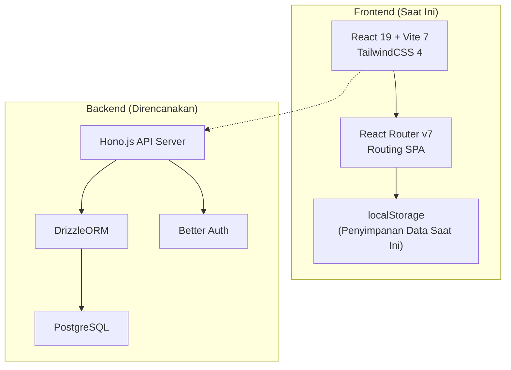
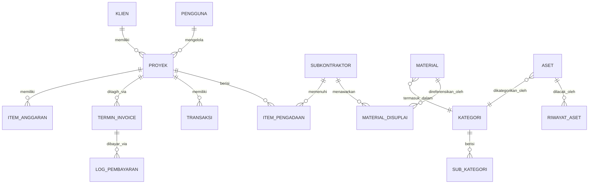
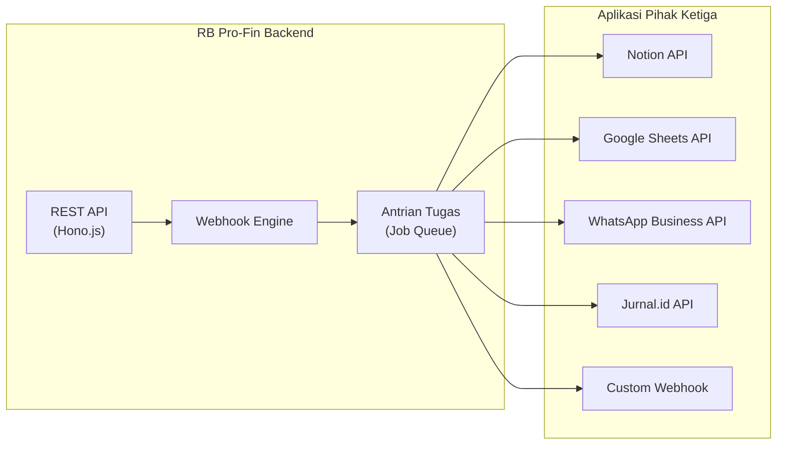
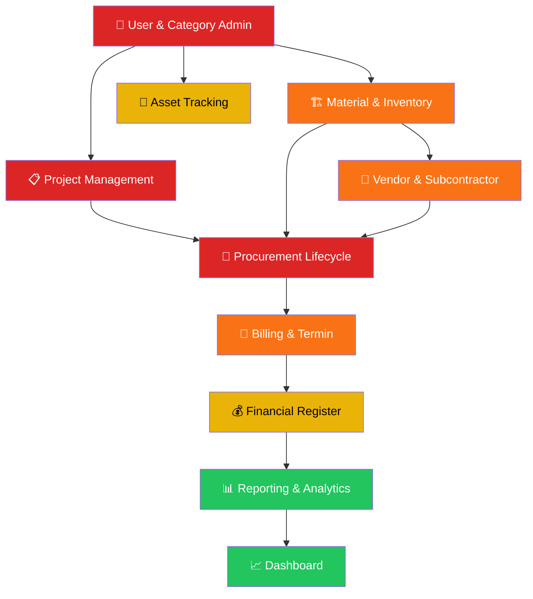

# Dokumen Kebutuhan Produk (PRD)
## RB Pro-Fin — Platform Manajemen Proyek Konstruksi & Keuangan

| Kolom              | Detail                                              |
|--------------------|-----------------------------------------------------|
| **Nama Produk**    | RB Pro-Fin                                          |
| **Versi**          | 1.0 (MVP)                                           |
| **Penulis**        | Tim Produk RB Pro-Fin                                |
| **Tanggal**        | 4 Maret 2026                                         |
| **Status**         | Draf — Menunggu Tinjauan Pemangku Kepentingan        |

---

## 1. Ringkasan Eksekutif

**RB Pro-Fin** adalah aplikasi web terintegrasi yang dirancang untuk **Rancangbangun123** (perusahaan konstruksi berbasis di Indonesia) untuk mendigitalisasi dan menyederhanakan alur kerja manajemen proyek, pengadaan barang, manajemen subkontraktor, pelacakan material & aset, penagihan, akuntansi, dan pelaporan keuangan. Platform ini menggantikan spreadsheet manual dan tools yang terpisah-pisah dengan portal terpusat berbasis peran.

---

## 2. Tujuan Produk

| #  | Tujuan                                          | Target Terukur                           |
|----|------------------------------------------------|------------------------------------------|
| T1 | Sentralisasi seluruh data proyek konstruksi    | 100% proyek aktif tercatat di aplikasi   |
| T2 | Otomasi siklus pengadaan barang                | Mengurangi waktu PR-ke-DO sebesar 40%    |
| T3 | Visibilitas keuangan secara real-time          | KPI Dashboard diperbarui dalam 24 jam    |
| T4 | Menerapkan kontrol akses berbasis peran        | Nol insiden akses data tidak sah         |
| T5 | Mengelola registrasi & persetujuan subkontraktor| Semua registrasi subkon melalui alur persetujuan |
| T6 | Melacak harga material & utilisasi aset        | Varian harga material ≤ 5% terhadap AHS |
| T7 | Membuat invoice & tagihan termin profesional   | Waktu pembuatan invoice < 5 menit        |

---

## 3. Pengguna Sasaran & Persona

### 3.1 Peran Pengguna

| Peran               | Deskripsi                                                                   | Hak Akses Utama                                                               |
|---------------------|----------------------------------------------------------------------------|-------------------------------------------------------------------------------|
| **Admin**           | Administrator sistem penuh                                                  | Semua modul + Manajemen Pengguna + lihat semua proyek                          |
| **Project Manager** | Mengelola proyek konstruksi, pengadaan, dan logistik                        | Proyek (milik sendiri), Kategori, Logistik, Akuntansi                          |
| **Finance**         | Mengelola invoice, pembayaran, akuntansi, dan laporan keuangan             | Semua proyek (lihat), Kategori, Logistik, Keuangan (Invoice + Akuntansi + Laporan) |
| **Site Manager**    | Supervisor lapangan yang mengawasi logistik dan progres proyek              | Proyek (milik sendiri), Kategori, Logistik, Akuntansi                          |

### 3.2 Persona

> **Aldo** — Project Manager, 32 tahun, mengelola 2-3 proyek residensial di Bandung secara bersamaan. Butuh pembuatan PR cepat dan pelacakan pengadaan real-time dari lapangan.

> **Rai** — Finance Manager, 28 tahun, bertanggung jawab atas seluruh penagihan termin dan rekonsiliasi pembayaran. Butuh visibilitas instan terhadap invoice yang belum dibayar dan arus kas.

> **Pram** — Site Manager, 35 tahun, mengkoordinasikan pengiriman material dan pekerjaan subkontraktor di lokasi. Butuh konfirmasi DO yang ramah perangkat mobile dengan unggahan foto.

> **Admin Pro-Fin** — Administrator kantor yang mengelola konfigurasi sistem, akun pengguna, dan data master.

---

## 4. Arsitektur Sistem



> MVP saat ini berjalan sepenuhnya di frontend menggunakan **localStorage** untuk penyimpanan data.
---

## 5. Fitur Utama & Spesifikasi Modul

### 5.1 Dashboard

**Tujuan:** Ringkasan eksekutif seluruh proyek konstruksi dan metrik keuangan utama.

| Fitur                       | Deskripsi                                                                      |
|-----------------------------|-------------------------------------------------------------------------------|
| Kartu Ringkasan Proyek      | Proyek aktif dengan status, progress bar, PM yang ditugaskan, dan indikator kesehatan |
| KPI Keuangan                | Total nilai kontrak, total biaya, persentase margin (format IDR)               |
| Aksi Cepat                  | Buat proyek baru, navigasi ke modul mana pun                                  |
| Indikator Kesehatan Proyek  | Kode warna: Excellent, Good, Warning, Critical                                 |

---

### 5.2 Proyek (Manajemen Proyek)

**Tujuan:** Manajemen siklus proyek penuh dari inisiasi hingga penyelesaian.

| Fitur                    | Deskripsi                                                                        |
|--------------------------|---------------------------------------------------------------------------------|
| Daftar Proyek            | Daftar yang dapat difilter dan dicari dengan badge status                         |
| Buat Proyek              | Modal dengan: nama, lokasi, klien (terhubung ke DB Klien), penugasan PM, nilai   |
| Detail Proyek            | Halaman khusus dengan rincian anggaran, pelacakan progres, dan timeline aktivitas|
| Pengatur Progres         | Pelacakan progres granular dengan penyesuaian persentase                          |
| Manajemen Anggaran       | Tambah/edit item anggaran per proyek (terhubung ke database material)             |
| Status Proyek            | Ongoing → BAST-1 → Maintenance → Completed                                      |
| Tautan Klien             | Setiap proyek diasosiasikan dengan data klien                                    |

---

### 5.3 Pengadaan (Procurement)

**Tujuan:** Siklus pengadaan menyeluruh yang dikelola melalui **Kanban board** interaktif.

#### Fase Kanban

| Fase                  | Key         | Deskripsi                                                                      |
|-----------------------|-------------|-------------------------------------------------------------------------------|
| PR (Permintaan)       | `pr`        | Permintaan Pembelian — daftar material, kuantitas, estimasi biaya              |
| PO (Purchase Order)   | `po`        | Nomor PO, pemilihan supplier, harga negosiasi                                  |
| Invoice               | `invoice`   | Pelacakan invoice vendor, dukungan tagihan parsial                             |
| DO (Diterima)         | `do`        | Konfirmasi pengiriman — nama penerima, waktu, foto/video, pengecekan kualitas  |
| Evaluasi              | `evaluation`| Penilaian dan catatan evaluasi supplier                                        |
| Selesai (Done)        | `done`      | Item pengadaan yang telah selesai                                              |

| Fitur                      | Deskripsi                                                                        |
|----------------------------|---------------------------------------------------------------------------------|
| Drag & Drop Transisi       | Pindahkan item antar fase dengan modal validasi                                  |
| Modal Transisi Fase        | Form dinamis yang berubah berdasarkan fase asal → tujuan                         |
| Modal Edit Item            | Pengeditan inline item di fase mana pun                                          |
| Modal Riwayat              | Jejak audit lengkap seluruh transisi fase per item                               |
| Modal Detail Pengadaan     | Tampilan detail dengan line item, info vendor, dan lampiran                       |
| Perpindahan Mundur         | Mendukung pengembalian item ke fase sebelumnya dengan data rollback              |
| Pengecekan Kualitas Material| Cek kondisi per-material (Sesuai / Tidak Sesuai) saat fase DO                   |

---

### 5.4 Subkontraktor (Manajemen Subkontraktor)

**Tujuan:** Registrasi vendor, alur persetujuan, dan pelacakan kinerja.

| Fitur                      | Deskripsi                                                                        |
|----------------------------|---------------------------------------------------------------------------------|
| Database Vendor            | Registrasi lengkap: nama, alamat, tipe, PIC, kontak, rating, status             |
| Registrasi & Persetujuan   | Alur persetujuan multi-level: Pending → Pending L1 → Active                     |
| Material yang Disuplai     | Hubungkan subkontraktor ke material yang disuplai beserta harga                   |
| Riwayat Transaksi          | Riwayat PO, jumlah, dan status per vendor                                        |
| Rating Vendor              | Sistem rating 0–5 bintang                                                        |
| Manajemen Blacklist        | Tandai vendor bermasalah dengan status "Blacklist"                               |
| Pelacakan Volume per PM    | Lacak volume belanja per Project Manager dengan persentase                        |
| Katalog Supply             | Tambah/edit material yang disuplai dengan harga khusus per vendor                 |

---

### 5.5 Database Material

**Tujuan:** Data master seluruh material konstruksi dengan harga, kategorisasi, dan konversi satuan.

| Fitur                      | Deskripsi                                                                        |
|----------------------------|---------------------------------------------------------------------------------|
| Daftar Master Material     | ID, nama, kategori, sub-kategori, satuan, harga, harga AHS, status              |
| Kategorisasi               | Hierarkis: Kategori → Sub-Kategori (misal: Material > Besi & Baja)               |
| ID Otomatis                | Format: `{PREFIX_KAT}-{PREFIX_SUBKAT}-{URUT}` (misal: `BES-BAJ-001`)            |
| Tren Harga                 | Indikator tren Naik/Turun/Stabil dengan persentase perubahan                     |
| Perbandingan Harga AHS     | Perbandingan langsung dengan standar harga AHS pemerintah                         |
| Konversi Satuan            | UoM dasar, faktor konversi, dan dukungan satuan standar                           |
| Impor (Excel/CSV)          | Impor massal via Google Sheets / Excel dengan pemetaan kolom                      |
| Klasifikasi Rencana        | Tag "Rencana Perusahaan" per material                                            |

---

### 5.6 Aset & Inventaris

**Tujuan:** Melacak aset fisik (alat, peralatan, kendaraan) di seluruh proyek dan gudang.

| Fitur                      | Deskripsi                                                                        |
|----------------------------|---------------------------------------------------------------------------------|
| Registrasi Aset            | ID, nama, merek, kategori, sub-kategori, nomor seri, tahun pembelian             |
| Pelacakan Status           | Digunakan, Tersedia, Maintenance, Rusak                                          |
| Pelacakan Lokasi           | Lokasi saat ini dipetakan ke proyek atau gudang                                   |
| Rincian Stok               | Rincian kuantitas per unit berdasarkan status dan lokasi (misal: Scaffolding)     |
| Riwayat Transfer Aset      | Timeline perpindahan antar proyek dan gudang                                      |
| Alur Permintaan Aset       | Alur permintaan/persetujuan untuk penempatan aset                                 |
| Dukungan Gambar            | Foto aset untuk identifikasi                                                     |
| Catatan Kondisi            | Teks bebas kondisi dengan tanggal servis terakhir                                 |

---

### 5.7 Invoice & Tagihan Termin

**Tujuan:** Membuat invoice, mengelola jadwal pembayaran berbasis termin, dan melacak log pembayaran.

| Fitur                      | Deskripsi                                                                        |
|----------------------------|---------------------------------------------------------------------------------|
| Database Klien             | Data klien (nama, tipe, kontak, email, alamat) untuk pembuatan invoice           |
| Timeline Termin            | Definisi milestone pembayaran (Termin 1, 2, 3...) dengan % progres dan jumlah    |
| Pembuatan Invoice          | Invoice PDF profesional dengan header perusahaan, rincian biaya, dan pajak       |
| Log Pembayaran             | Lacak pembayaran yang diterima dengan tanggal, jumlah, metode, dan referensi     |
| Invoice Massal             | Pilih beberapa termin dan buat invoice gabungan                                   |
| Status Pembayaran          | Lunas / Belum Dibayar / Sebagian, dilacak per termin                             |
| Tautan Klien-Proyek        | Filter invoice berdasarkan klien dan proyek                                       |

---

### 5.8 Akuntansi

**Tujuan:** Mencatat dan mengkategorikan transaksi keuangan per proyek.

| Fitur                      | Deskripsi                                                                        |
|----------------------------|---------------------------------------------------------------------------------|
| Register Transaksi         | Catat transaksi pemasukan/pengeluaran dengan tanggal, kategori, jumlah, deskripsi|
| Buku Besar per Proyek      | Semua transaksi terhubung ke proyek tertentu                                      |
| Modal Tambah Transaksi     | Input multi-kategori (biaya material, tenaga kerja, overhead, lain-lain)         |
| Format Mata Uang           | Rupiah Indonesia (IDR) dengan format lokal                                        |
| Hapus Transaksi            | Soft-delete dengan dialog konfirmasi                                              |

---

### 5.9 Laporan

**Tujuan:** Laporan keuangan dan proyek untuk pengambilan keputusan manajemen.

| Fitur                      | Deskripsi                                                                        |
|----------------------------|---------------------------------------------------------------------------------|
| Laporan Keuangan           | Laporan dengan pemasukan, pengeluaran, dan ringkasan laba/rugi                   |
| Laporan Proyek             | Laporan kinerja proyek dengan progres, utilisasi anggaran, dan kesehatan          |
| Filter Proyek              | Lihat laporan berdasarkan proyek tertentu                                         |

---

### 5.10 Kategori & Manajemen Pengguna

#### Kategori
| Fitur                      | Deskripsi                                                                        |
|----------------------------|---------------------------------------------------------------------------------|
| CRUD Kategori              | Buat, edit, hapus kategori tingkat atas                                           |
| CRUD Sub-Kategori          | Buat, edit, hapus sub-kategori yang terhubung ke kategori induk                   |
| Seeding Otomatis           | Kategori otomatis di-seed dari database material saat pertama kali dimuat         |
| Hapus Berjenjang           | Menghapus kategori akan menghapus semua sub-kategori yang terkait                 |

#### Manajemen Pengguna
| Fitur                      | Deskripsi                                                                        |
|----------------------------|---------------------------------------------------------------------------------|
| Daftar Pengguna            | Lihat semua pengguna dengan nama, email, peran, status                            |
| Buat/Edit Pengguna         | Atur nama, email, password, peran, status                                         |
| Penugasan Peran            | Admin, Project Manager, Finance, Site Manager                                     |
| Status Akun                | Toggle Aktif / Tidak Aktif                                                        |

---

## 6. Cerita Pengguna (User Stories)

### 6.1 Cerita Project Manager

| ID    | Cerita                                                                                              | Kriteria Penerimaan                                                |
|-------|-----------------------------------------------------------------------------------------------------|--------------------------------------------------------------------|
| PM-01 | Sebagai PM, saya ingin membuat Permintaan Pembelian agar bisa mengajukan material untuk proyek saya | PR muncul di Kanban board dengan detail material yang lengkap      |
| PM-02 | Sebagai PM, saya ingin memindahkan PR ke PO agar bisa mencatat pemilihan vendor dan harga           | Modal transisi fase terbuka dengan field khusus PO                 |
| PM-03 | Sebagai PM, saya ingin mengonfirmasi pengiriman material (DO) dengan foto sebagai bukti penerimaan  | Form DO menangkap penerima, waktu, foto/video, dan cek kualitas    |
| PM-04 | Sebagai PM, saya ingin melihat rincian anggaran proyek saya untuk memantau biaya vs. nilai          | Halaman detail proyek menampilkan anggaran vs. pengeluaran aktual  |
| PM-05 | Sebagai PM, saya ingin mencari database material untuk mengetahui harga terkini sebelum membuat PR  | Pencarian menampilkan hasil dengan harga, tren, dan perbandingan AHS |

### 6.2 Cerita Finance

| ID    | Cerita                                                                                              | Kriteria Penerimaan                                                |
|-------|-----------------------------------------------------------------------------------------------------|--------------------------------------------------------------------|
| FN-01 | Sebagai Finance, saya ingin membuat invoice termin agar bisa menagih klien per milestone             | Invoice PDF dihasilkan dengan jumlah, pajak, dan format yang benar |
| FN-02 | Sebagai Finance, saya ingin mencatat pembayaran yang diterima agar bisa merekonsiliasi akun          | Entri log pembayaran dengan tanggal, jumlah, metode, dan referensi |
| FN-03 | Sebagai Finance, saya ingin melihat laporan keuangan di seluruh proyek untuk memantau arus kas       | Laporan Keuangan menampilkan pemasukan, pengeluaran, dan L/R agregat |
| FN-04 | Sebagai Finance, saya ingin mencatat transaksi di modul akuntansi per proyek                        | Transaksi muncul di buku besar proyek dengan kategori yang benar    |

### 6.3 Cerita Admin

| ID    | Cerita                                                                                              | Kriteria Penerimaan                                                |
|-------|-----------------------------------------------------------------------------------------------------|--------------------------------------------------------------------|
| AD-01 | Sebagai Admin, saya ingin mengelola akun pengguna agar bisa mengontrol akses sistem                 | Pengguna dapat dibuat, diedit, diaktifkan, dan dinonaktifkan        |
| AD-02 | Sebagai Admin, saya ingin menyetujui registrasi subkontraktor untuk memastikan kualitas vendor       | Alur persetujuan multi-level dengan transisi status                 |
| AD-03 | Sebagai Admin, saya ingin mengelola kategori material agar database tetap terorganisir              | Kategori dan sub-kategori dapat dibuat, diedit, dan dihapus         |
| AD-04 | Sebagai Admin, saya ingin mengimpor material secara massal agar tidak perlu memasukkan satu per satu | Impor Excel memetakan kolom dengan benar dan membuat record material|

### 6.4 Cerita Site Manager

| ID    | Cerita                                                                                              | Kriteria Penerimaan                                                |
|-------|-----------------------------------------------------------------------------------------------------|--------------------------------------------------------------------|
| SM-01 | Sebagai Site Manager, saya ingin mengajukan aset untuk proyek agar peralatan yang tepat tersedia     | Permintaan aset terkirim dengan kuantitas, proyek, dan justifikasi  |
| SM-02 | Sebagai Site Manager, saya ingin melihat lokasi aset untuk mengetahui apa yang tersedia di lokasi    | Daftar aset difilter per proyek menampilkan qty, kondisi, dan status|
| SM-03 | Sebagai Site Manager, saya ingin mengonfirmasi pengiriman material di lokasi dengan cek kondisi      | Konfirmasi DO dengan cek kualitas per material (Sesuai/Tidak Sesuai)|

---

## 7. Persyaratan Teknis

### 7.1 Frontend (Saat Ini)

| Teknologi         | Versi    | Tujuan                                       |
|-------------------|----------|----------------------------------------------|
| React             | 19.2     | Framework UI                                  |
| Vite              | 7.3      | Build tool & dev server                        |
| TailwindCSS       | 4.1      | Styling CSS utility-first                      |
| React Router      | 7.13     | Routing sisi klien                             |
| @hello-pangea/dnd | 18.0     | Drag & drop untuk Kanban board                 |
| xlsx              | 0.18     | Parsing file Excel untuk impor                 |

### 7.2 Backend (Direncanakan)

| Teknologi         | Tujuan                                       |
|-------------------|----------------------------------------------|
| Hono.js           | Server API HTTP ringan                        |
| DrizzleORM        | ORM SQL type-safe                             |
| PostgreSQL        | Database relasional                           |
| Better Auth       | Autentikasi & manajemen sesi                  |
| Docker            | Deployment terkontainerisasi                   |

### 7.3 Persyaratan Non-Fungsional

| Kategori           | Persyaratan                                                                      |
|--------------------|---------------------------------------------------------------------------------|
| **Performa**       | Muat halaman ≤ 2 detik pada 4G, first meaningful paint ≤ 1.5 detik             |
| **Responsivitas**  | Desain mobile-first (sidebar tertutup pada < 1024px)                            |
| **Keamanan**       | Kontrol akses berbasis peran, autentikasi berbasis sesi, hashing password        |
| **Integritas Data**| Semua operasi CRUD harus atomik; tidak boleh ada penulisan parsial              |
| **Ketersediaan**   | Target uptime 99.5% untuk deployment produksi                                   |
| **Lokalisasi**     | Bahasa Indonesia sebagai bahasa UI utama                                         |
| **Mata Uang**      | Semua nilai moneter dalam IDR dengan format lokal Indonesia                      |
| **Dukungan Browser**| Chrome 100+, Firefox 100+, Safari 16+, Edge 100+                               |

---

## 8. Model Data (Entitas Inti)



---

## 9. Metrik Keberhasilan & KPI

| KPI                                   | Target (6 bulan)        | Metode Pengukuran                        |
|----------------------------------------|-------------------------|------------------------------------------|
| Proyek aktif yang tercatat             | 100% proyek perusahaan  | Jumlah di Dashboard vs aktual            |
| Rata-rata waktu siklus persetujuan PR  | ≤ 3 hari kerja          | Selisih timestamp PR → PO                |
| Tingkat penyelesaian pengadaan         | ≥ 90%                   | Item yang mencapai "Selesai" / total item|
| Waktu pembuatan invoice               | < 5 menit               | Pelacakan sesi pengguna                  |
| Waktu respon persetujuan subkon        | ≤ 2 hari kerja          | Selisih timestamp Pending → Active       |
| Akurasi harga material vs AHS         | ≤ 5% varian             | Perbandingan otomatis di DB Material     |
| Uptime sistem                          | ≥ 99.5%                 | Monitoring server (pasca-peluncuran backend) |
| Tingkat adopsi pengguna               | ≥ 80% dalam 3 bulan     | Login aktif / total pengguna terdaftar   |
| Tingkat kesalahan input data          | Berkurang 60%            | Dibandingkan dengan catatan manual sebelumnya |

---

## 10. Risiko & Mitigasi

| #  | Risiko                                         | Dampak   | Kemungkinan | Mitigasi                                                                |
|----|------------------------------------------------|----------|-------------|-------------------------------------------------------------------------|
| R1 | **Kehilangan data (localStorage)**             | Tinggi   | Tinggi      | Prioritas: Migrasi backend ke PostgreSQL dengan strategi backup         |
| R2 | **Tidak ada sinkronisasi multi-pengguna**      | Tinggi   | Tinggi      | Implementasi WebSocket/SSE untuk update real-time pasca-backend         |
| R3 | **Password plaintext di kode sisi klien**      | Kritis   | Tinggi      | Migrasi ke Better Auth dengan hashing bcrypt segera                     |
| R4 | **Tidak ada dukungan offline saat transisi**    | Sedang   | Sedang      | Implementasi service worker / kapabilitas PWA                           |
| R5 | **Penurunan performa saat data bertambah**     | Sedang   | Sedang      | Implementasi paginasi, virtual scrolling, dan indexing database         |
| R6 | **Konflik data antar tab browser**             | Sedang   | Sedang      | Gunakan event `storage` window (sudah sebagian diimplementasi)          |
| R7 | **Resistensi pengguna terhadap sistem baru**   | Sedang   | Sedang      | Peluncuran bertahap dengan pelatihan, bersamaan dengan proses manual    |
| R8 | **Bottleneck persetujuan subkontraktor**       | Rendah   | Sedang      | Siapkan sistem notifikasi/pengingat untuk persetujuan yang tertunda     |
| R9 | **Keterbatasan UX mobile**                     | Sedang   | Rendah      | Pertimbangkan aplikasi mobile native untuk pekerja lapangan (Fase 3)   |

---

## 11. Dependensi

| Dependensi                      | Tipe       | Status          | Dampak Jika Tertunda                              |
|--------------------------------|------------|-----------------|--------------------------------------------------|
| Backend API (Hono.js)          | Internal   | Dalam Pengembangan | Tetap menggunakan localStorage (tanpa multi-user) |
| Setup Database PostgreSQL      | Internal   | Direncanakan     | Tidak ada data persistent sisi server             |
| Infrastruktur Docker           | Internal   | Direncanakan     | Deployment manual ke server sebagai fallback      |
| Autentikasi (Better Auth)      | Internal   | Direncanakan     | Autentikasi plaintext saat ini tetap berlaku      |
| Integrasi API Google Sheets    | Eksternal  | Parsial          | Impor manual via ekspor Excel                     |
| UI Avatars API                 | Eksternal  | Aktif            | Fallback ke avatar lokal berbasis inisial         |

---

## 12. Peta Jalan (Roadmap) Bertahap

### Fase 1 — MVP Frontend
- [x] Semua 10 modul diimplementasi dengan localStorage
- [x] Routing berbasis peran dan sistem perizinan
- [x] Pengadaan berbasis Kanban dengan 6 fase
- [x] Database material dengan kapabilitas impor
- [x] Manajemen aset & inventaris
- [x] Pembuatan invoice dengan tagihan termin
- [x] Kategori dengan sub-kategori berjenjang

### Fase 2 — Migrasi Backend (Sedang Berlangsung)
- [ ] Server API Hono.js dengan DrizzleORM
- [ ] Database PostgreSQL dengan migrasi
- [ ] Integrasi Better Auth (login, signup, sesi)
- [ ] Endpoint REST API untuk semua operasi CRUD
- [ ] Integrasi Frontend ↔ Backend
- [ ] Kontainerisasi Docker

### Fase 3 — Penguatan Produksi
- [ ] Testing otomatis (unit + integrasi + E2E)
- [ ] Pipeline CI/CD (GitHub Actions)
- [ ] Monitoring error dan logging (Sentry/setara)
- [ ] Optimasi performa & code splitting
- [ ] Peningkatan PWA / responsif mobile

### Fase 4 — Fitur Lanjutan
- [ ] Notifikasi real-time (pengingat persetujuan, peringatan pengiriman)
- [ ] Manajemen dokumen (unggah kontrak, PDF PO, dll.)
- [ ] Pelaporan lanjutan dengan grafik dan ekspor
- [ ] Jejak audit / log aktivitas untuk semua modul
- [ ] Dukungan multi-perusahaan / multi-tenant
- [ ] Aplikasi mobile untuk pekerja lapangan (React Native / Flutter)

---

## 13. Integrasi Aplikasi Pihak Ketiga (API)

**Tujuan:** Menghubungkan RB Pro-Fin dengan aplikasi eksternal untuk memperluas ekosistem kerja, otomasi alur kerja, dan sinkronisasi data lintas platform.

### 13.1 Arsitektur Integrasi



> [!IMPORTANT]
> Seluruh integrasi pihak ketiga memerlukan **Backend API (Fase 2)** yang sudah aktif. Integrasi ini direncanakan untuk **Fase 4** dalam roadmap.

---

### 13.2 Notion API

**Tujuan:** Sinkronisasi data proyek, pengadaan, dan laporan ke workspace Notion untuk kolaborasi tim dan dokumentasi.

| Fitur                          | Deskripsi                                                                      | Endpoint Notion                  |
|-------------------------------|-------------------------------------------------------------------------------|----------------------------------|
| Sinkronisasi Proyek           | Push data proyek (nama, status, progres, PM) ke database Notion otomatis      | `POST /v1/pages`                 |
| Dashboard Pengadaan           | Kirim status Kanban board ke tabel Notion untuk visibilitas manajemen          | `PATCH /v1/pages/{id}`           |
| Log Keuangan                  | Sinkronisasi transaksi akuntansi ke database Notion sebagai backup/laporan     | `POST /v1/pages`                 |
| Notifikasi via Komentar       | Tambah komentar di halaman Notion saat ada event penting (persetujuan, DO)     | `POST /v1/comments`              |
| Impor dari Notion             | Tarik data dari database Notion ke Pro-Fin (misal: daftar material baru)       | `POST /v1/databases/{id}/query`  |

**Konfigurasi yang Diperlukan:**
- Notion Integration Token (Internal Integration)
- Database ID untuk setiap modul yang disinkronkan
- Mapping field antara Pro-Fin ↔ Notion property

**Alur Kerja Contoh — Sinkronisasi Proyek ke Notion:**
```
1. PM membuat/update proyek di Pro-Fin
2. Backend mendeteksi perubahan → trigger webhook
3. Job queue memproses request ke Notion API
4. Data proyek dibuat/diperbarui di database Notion
5. Tim manajemen melihat update real-time di Notion
```

---

### 13.3 Google Sheets API

**Tujuan:** Sinkronisasi dua arah antara Pro-Fin dan Google Sheets untuk pengguna yang masih terbiasa dengan spreadsheet.

| Fitur                          | Deskripsi                                                                      |
|-------------------------------|-------------------------------------------------------------------------------|
| Ekspor Laporan ke Sheets      | Otomatis push laporan keuangan dan proyek ke spreadsheet terjadwal             |
| Impor Material (Upgrade)      | Upgrade fitur impor yang ada untuk langsung terhubung via API (tanpa unduh manual) |
| Live Dashboard Spreadsheet    | Sinkronisasi KPI dashboard ke sheet untuk presentasi manajemen                 |
| Backup Data                   | Jadwalkan ekspor data berkala ke Google Sheets sebagai backup                   |

---

### 13.4 WhatsApp Business API

**Tujuan:** Mengirim notifikasi otomatis ke stakeholder via WhatsApp untuk event-event penting.

| Event                          | Penerima          | Contoh Pesan                                                   |
|-------------------------------|-------------------|---------------------------------------------------------------|
| PR Baru Dibuat                | Admin / Approver  | "📋 PR baru #PR-1026 untuk proyek 117 - Dago Pakar menunggu persetujuan" |
| PO Disetujui                 | Project Manager   | "✅ PO #PO-2025-010 telah disetujui. Silakan koordinasi pengiriman"     |
| Material Diterima (DO)        | PM + Finance      | "📦 DO dikonfirmasi untuk #PR-1024. 5 dari 5 item diterima Sesuai"     |
| Invoice Terbit                | Klien             | "🧾 Invoice Termin 2 untuk proyek 113 - Ciwaruga telah dikirim"        |
| Pembayaran Diterima           | Finance + PM      | "💰 Pembayaran Rp 450.000.000 diterima untuk Termin 1 proyek 115"      |
| Persetujuan Subkon            | Admin             | "🔔 Subkontraktor PT Cahaya Baru menunggu persetujuan Level 1"          |

---

### 13.5 Webhook & REST API Umum

**Tujuan:** Menyediakan API terbuka agar aplikasi pihak ketiga mana pun bisa terhubung ke Pro-Fin.

| Komponen                       | Deskripsi                                                                      |
|-------------------------------|-------------------------------------------------------------------------------|
| REST API Publik               | Endpoint CRUD untuk semua modul (Proyek, Pengadaan, Material, Aset, dll.)      |
| Webhook Outgoing              | Kirim event ke URL tujuan saat terjadi perubahan data (create, update, delete) |
| Webhook Incoming              | Terima data dari aplikasi luar untuk diproses di Pro-Fin                       |
| API Key Management            | Buat & kelola API key per integrasi dengan rate limiting                        |
| Dokumentasi API (Swagger)     | Auto-generated OpenAPI docs di `/api/docs` untuk developer pihak ketiga        |
| Rate Limiting                 | Batas 100 request/menit per API key untuk menjaga stabilitas                   |

**Contoh Webhook Events:**

| Event                    | Payload Utama                                              |
|--------------------------|-----------------------------------------------------------|
| `project.created`        | `{ id, name, status, pm, value }`                         |
| `procurement.phase_changed` | `{ itemId, fromPhase, toPhase, timestamp }`            |
| `invoice.generated`      | `{ invoiceId, projectId, terminNo, amount }`              |
| `payment.received`       | `{ paymentId, invoiceId, amount, method }`                |
| `subcontractor.approved` | `{ subconId, name, approvedBy, level }`                   |
| `asset.transferred`      | `{ assetId, fromLocation, toLocation }`                   |
| `material.price_updated` | `{ materialId, oldPrice, newPrice, trend }`               |

**Contoh Penggunaan API:**

```
# Ambil daftar proyek aktif
GET /api/v1/projects?status=Ongoing
Authorization: Bearer {API_KEY}

# Buat Purchase Request baru
POST /api/v1/procurement/pr
Authorization: Bearer {API_KEY}
Content-Type: application/json
{
  "projectId": "117",
  "materials": [
    { "materialId": "BES-BAJ-001", "qty": 100, "unit": "Batang" }
  ],
  "notes": "Kebutuhan mendesak untuk pondasi"
}

# Daftarkan webhook untuk event pengadaan
POST /api/v1/webhooks
Authorization: Bearer {API_KEY}
{
  "url": "https://your-app.com/webhook",
  "events": ["procurement.phase_changed", "payment.received"]
}
```

---

### 13.6 Prioritas Implementasi Integrasi

| Prioritas | Integrasi            | Fase  | Alasan                                                        |
|-----------|---------------------|-------|--------------------------------------------------------------|
| 🔴 Tinggi | REST API & Webhook  | Fase 2 | Fondasi untuk semua integrasi lain                            |
| 🔴 Tinggi | WhatsApp Business   | Fase 3 | Kebutuhan notifikasi mendesak dari tim lapangan               |
| 🟡 Sedang | Notion API          | Fase 4 | Kolaborasi tim manajemen dan dokumentasi                      |
| 🟡 Sedang | Google Sheets API   | Fase 4 | Transisi bertahap dari spreadsheet manual                     |
---

## 14. Prioritas Pengembangan Fitur

Urutan pengembangan modul backend berdasarkan **dampak bisnis**, **dependency antar modul**, dan **frekuensi penggunaan harian**.

### 14.1 Tabel Prioritas

| Urutan | Modul | Skor | Alasan |
|:---:|---|:---:|---|
| **1** | **User & Category Administration** | ⭐⭐⭐⭐⭐ | Fondasi semua modul lain. Auth harus jalan duluan, role & permission harus ready sebelum modul lain bisa dipakai. Kategori dipakai oleh Material, Aset, dan Pengadaan. |
| **2** | **Project Management** | ⭐⭐⭐⭐⭐ | Entitas utama. Hampir semua modul lain bergantung pada `projectId` — pengadaan, invoice, akuntansi, laporan semua terikat ke proyek. |
| **3** | **Procurement Lifecycle** | ⭐⭐⭐⭐⭐ | Aktivitas harian paling intensif. 6 fase Kanban, dipakai PM & Site Manager setiap hari, volume data paling tinggi. |
| **4** | **Material & Inventory** | ⭐⭐⭐⭐ | Dependency dari Procurement. PR butuh data material (harga, satuan). Material juga dipakai Subkontraktor untuk katalog supply. |
| **5** | **Vendor & Subcontractor Management** | ⭐⭐⭐⭐ | Dependency dari Procurement. PO butuh data vendor. Approval flow penting untuk quality control supplier. |
| **6** | **Billing & Termin Management** | ⭐⭐⭐⭐ | Revenue stream. Ini yang menghasilkan uang — invoice ke klien harus akurat dan cepat. |
| **7** | **Financial Register** | ⭐⭐⭐ | Pelengkap Billing. Setelah invoice jalan, butuh pencatatan transaksi masuk/keluar per proyek. |
| **8** | **Asset Tracking** | ⭐⭐⭐ | Penting tapi independen. Tidak blocking modul lain. Bisa dikembangkan paralel. |
| **9** | **Reporting & Analytics** | ⭐⭐ | Konsumsi data, bukan produksi data. Laporan hanya berguna kalau data dari modul 1–8 sudah lengkap. |
| **10** | **Dashboard & Summary Reporting** | ⭐⭐ | Paling akhir. Dashboard hanya agregasi dari semua modul lain — belum ada gunanya kalau data belum lengkap. |

### 14.2 Diagram Dependency Antar Modul



**Legenda:** 🔴 Kritis → 🟠 Penting → 🟡 Sedang → 🟢 Nice-to-Have

### 14.3 Logika Pengurutan

1. **Auth & master data dulu** (User, Kategori) — tanpa ini tidak bisa login
2. **Proyek** — semua modul lain terikat ke proyek sebagai entitas utama
3. **Pengadaan + Material + Vendor** — ini *core business* operasional harian
4. **Keuangan** (Billing → Akuntansi) — butuh data dari pengadaan yang sudah jalan
5. **Aset** — penting tapi independen, bisa dikerjakan paralel dengan keuangan
6. **Laporan & Dashboard terakhir** — karena hanya *membaca* data, bukan *memproduksi* data

---
